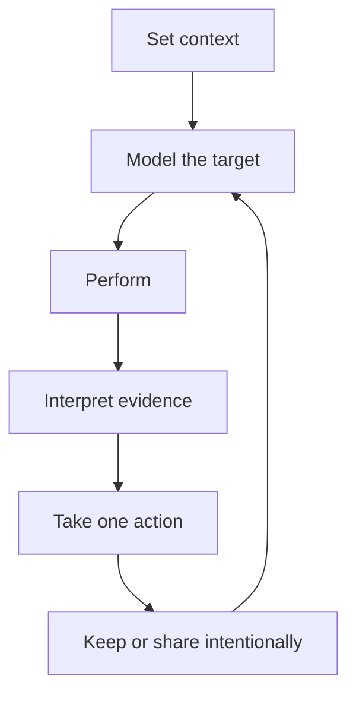
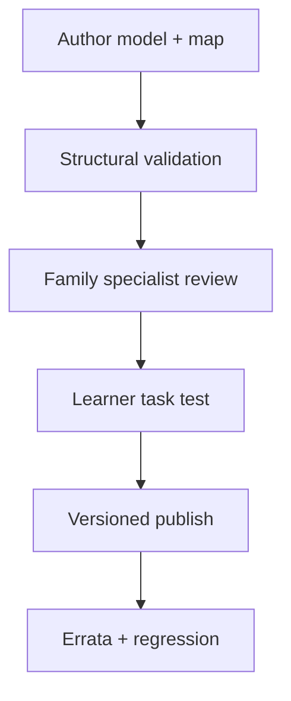
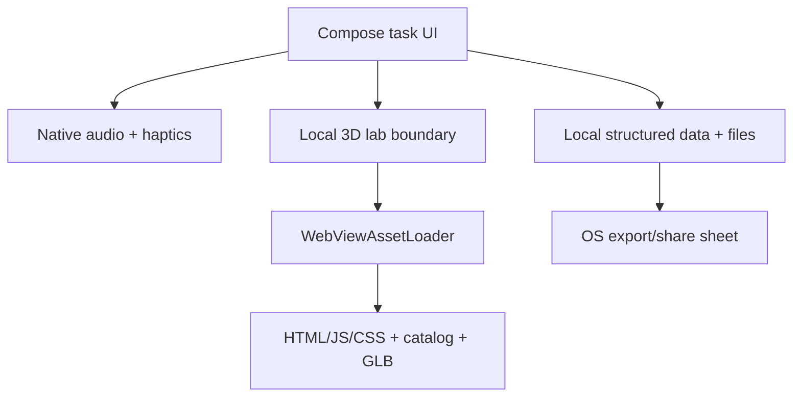

# Bocal product, UX, technical and asset handoff

Version 0.2 reference handoff · 10 August 2026

## Executive decision

Bocal should compete as **the fastest path from a musical intention to a useful next action**. TonalEnergy has a formidable breadth of documented features; copying its screen density would reproduce the problem Bocal is supposed to solve. The winning shape is a task-first shell with six stable verbs—**Tune, Lab, Pulse, Sound, Analyze, Practice**—and saved workspaces that reveal advanced controls only when the job requires them.

This package is a serious starting system, not a false “full parity complete” claim:

- A standalone static web app builds successfully and implements live tuning, transposition, reference pitch, pitch history, a metronome, tone generation, basic signal analysis, practice timing/journaling, local recording/download, and interactive 3D.
- An original asset generator produces **35 educational woodwind GLBs with 465 named interactive controls**. Ten are saxophones. All models pass structural validation.
- The alto saxophone is the first note-mapped instrument, with a core written B-flat3–F6 chart in the application data. The other models expose recognizable parts and controls but intentionally withhold note-level claims pending specialist validation.
- A native Kotlin/Jetpack Compose Android Studio project contains the code path I would use for the first APK: native microphone tuner, metronome, reference tone, analysis snapshot, practice data, and a local `WebViewAssetLoader` lab. It declares no Internet permission.
- No APK is included because the execution environment has Java but no Android SDK, Platform/Build Tools, `aapt2`, Gradle executable or wrapper JAR. The build and APK verification scripts are supplied. Renaming a ZIP to `.apk` would be dishonest and unusable.
- The hosted `chatgpt.site` URL still reflects the previous Cloudflare Worker failure. The inspected failure path initialized Three.js/GLTF loading code in a server/Worker context. The source copy includes a client-only dynamic-load fix, but this handoff does not claim the public deployment changed. The standalone build avoids that Worker runtime entirely.

## 1. Product thesis

### 1.1 The user promise

> Open Bocal, choose what you are trying to improve, and receive one legible correction—without creating an account or learning the app first.

Three layers make that defensible:

1. **Speed layer** — persistent instrument context, written/concert clarity, one primary action, saved workspaces and sensible presets.
2. **Teaching layer** — interactive instrument models, note-to-fingering and fingering-to-note, part/finger vocabulary, transposition explanations and validated alternatives.
3. **Evidence layer** — pitch trace, signal descriptors, metronome/timer, recordings and a local practice history that lead to an action rather than a decorative score.

TonalEnergy competes on breadth and depth. Bocal must reach comparable professional capability while reducing navigation cost and adding a learning representation the incumbent does not center: the instrument itself.

### 1.2 Product principles

- **The task is the navigation.** Six verbs are easier to recall than a feature taxonomy.
- **Written and sounding pitch are never ambiguous.** Instrument context is prominent and atomic.
- **Describe evidence; do not grade artistry.** “Upper harmonics increased” is evidence. “Your tone is bad” is not.
- **Progressive disclosure preserves professional depth.** Beginner mode changes defaults and density, not the underlying engine.
- **Offline is a trust and reliability feature.** Core practice must work in a rehearsal room, school or venue with no account/network.
- **Accessibility is an equivalent interaction, not a later label.** Color, 3D touch and audio each require another route to the same decision.
- **Educational content has release governance.** A polished wrong fingering is worse than a plain correct chart.

### 1.3 Primary success measures

| Outcome | Measure | Initial gate |
|---|---|---|
| Faster comprehension | Median time from cold open to first stable written-pitch correction | Under 15 seconds for a returning user; benchmark against the incumbent on the same device |
| Accurate tuning | Gross pitch accuracy, octave error and cent error on a labeled woodwind corpus | Publish measured supported range; no unsupported C0–C8 claim |
| Reliable pulse | Tempo error and drift over 30 minutes; recovery from audio focus changes | No accumulated beat drift outside the defined threshold |
| Useful learning | Fingering recall after a short 3D lesson versus a static chart | Pre-register task; test note and reverse lookup separately |
| Lower navigation cost | Task completion time/errors for tune, drone, preset, record and review | Bocal faster on at least four of five core tasks without hiding capability |
| Trust | Percentage of users who correctly understand where audio/data goes | At least 90% after onboarding/privacy check |
| Quality | Crash-free sessions, audio-route failures and WebView model failures | Release threshold defined before beta, segmented by device/API |

## 2. Research and incumbent definition

The primary competitive source is TonalEnergy's own [Android/Desktop user guide](https://www.tonalenergy.com/tet-user-guide-android), cross-checked with its [mobile product page](https://www.tonalenergy.com/te-mobile). That documentation establishes a much larger parity surface than “tuner + metronome”: target/bar tuning, tenths-of-cent display, volume/tone meters, notation/transposition/reference A, modes/ranges/damping, provided and custom temperaments, pitch tracking/timed events/activity; a deeply programmable metronome; tone exercises and sound libraries; waveform/spectral/harmonic/staff/interval analysis; recording organization/editing/import/export/time/pitch manipulation; external/MIDI/Link/BodyBeat integrations; personalization, languages and accessibility.

The full research ledger is in `research/Research_Sources_and_Method.md`. The feature-by-feature competitive contract is `research/TE_Parity_Matrix.csv`, with **84 rows** and an acceptance-evidence column. This matters because parity should be a test plan, not a marketing adjective.

### 2.1 What Bocal must match

| Capability group | Parity expectation |
|---|---|
| Tuning | Precise chromatic detection across a declared range, transposition, adjustable A, temperament/key context, sensitivity/damping, pitch/session history and professional readability. |
| Pulse | Common and unusual meters/subdivisions, tap/numeric control, accents/sounds/visual/haptics, count-ins, silence exercises, reusable presets, sequences/loops, tempo/meter automation and professional synchronization/control. |
| Sound | Quick reference notes plus sustained chords/drones, high-quality/original or licensed sounds, temperaments, exercises, scales/intervals/harmonics and auto-follow where acoustically safe. |
| Analyze | Pitch/waveform, spectrum/harmonics, note history/staff, interval work, onset/body/release, vibrato, level and meaningful comparisons. |
| Record | Durable audio capture/playback, names/folders, trim, import/export, selected non-destructive transformations and platform-appropriate video later. |
| Practice | Timers, goals/history, per-note evidence, plans/notes and portable exchange. |
| Platform | Accessibility, notation/localization, external audio/display/control, offline behavior, data portability and calibrated device quality. |

### 2.2 Where Bocal should surpass

- Interactive, instrument-specific learning rather than a generic pitch display.
- A reverse question: “Given these pressed controls, what note/fingering is this?”
- One workspace per job, with context-specific advanced controls rather than global preference archaeology.
- Equipment/reed/setup context connected to observations.
- Local-first exchange and clear export previews.
- Tone language that supports artistic intent and teacher judgment rather than optimizing one universal brightness target.
- Accessible non-3D equivalents for every model action.

### 2.3 Research boundary

This is desk research plus build evidence. It is not independent proof that Bocal is more accurate, faster or easier than TonalEnergy. Those claims require moderated task tests and a shared labeled audio/device benchmark. Public documentation also cannot reveal the incumbent's algorithms, licensed recordings, defects, retention or roadmap.

## 3. Personas and user journeys

Ten primary personas cover the first consumer system. The full table contains exactly five workflows for each in `research/Personas_and_50_Workflows.md`.

| Persona | Five priority jobs |
|---|---|
| First-week beginner | Find a fingering; confirm intended note; understand a jump; finish a ten-minute plan; retain the lesson cue. |
| School-band student | Prepare a scale; fix a rehearsal note; practice with pulse; submit minimal evidence; restart after a missed day. |
| Adult beginner/returner | Rebuild long tones; learn unfamiliar fingerings; maintain a flexible routine; compare setup; prepare for rehearsal. |
| Advanced/conservatory student | Map intonation; train chord-role tuning; audit attacks/releases; program complex click; study validated extended fingerings. |
| Professional/doubler | Restore call setup; switch instruments safely; diagnose entrances; run show click; work fully offline. |
| Private teacher | Demonstrate fingering; capture baseline; assign focused plan; annotate student bundle; switch students/instruments safely. |
| Ensemble director | Tune/project; teach chord balance; run rhythm rehearsal; distribute assignment; review minimal aggregate evidence. |
| Section leader/peer coach | Resolve transposition; match articulation; tune a chord; share a pulse; preserve rehearsal decisions. |
| Parent/guardian | Help start; see effort without surveillance; control minor data; share intended evidence; support maintenance. |
| Accessibility-first user | Tune without color; use non-3D control list; feel/see pulse; reduce motor/cognitive load; read chart summaries. |

### 3.1 Shared six-stage journey



1. **Set context:** player/profile, instrument, transposition, equipment, task and environment.
2. **Model the target:** note/fingering, tone/drone, pulse, excerpt or teacher instruction.
3. **Perform:** microphone/recording state is explicit; the primary correction remains legible.
4. **Interpret:** signed cents, stability, timing and signal shape are explained, not mystified.
5. **Act:** retry, change speed, change target/fingering, annotate or plan the next block.
6. **Retain/share:** save locally; preview the exact bundle before anything leaves the device.

### 3.2 Critical journey rules

- Switching instrument changes transposition, range/sensitivity, model, personal tendencies and saved workspace together.
- A beginner sees larger tolerances and less density, while a professional can reveal exact cent targets, damping and routing.
- Every analytic card ends with a suggested comparison or retry; no dead-end dashboard.
- A teacher can author interpretation. The app does not overrule contextual pedagogy.
- A minor never needs a public profile, social rank or remote surveillance to complete the learning job.
- 3D tapping is optional. Note and control lists expose the same state to TalkBack, keyboard and switch access.

## 4. Information architecture and UX specification

### Tune

Default surface: large written note, small concert note, frequency, signed cents, explicit flat/centered/sharp word, cent gauge and one Listen button. Instrument, A reference and tolerance are nearby, not buried. Advanced sheet: temperament/key, damping/mode/range, reference routing, display choice and session metrics.

Key UX guardrails:

- Never show an E-flat sax learner only the concert note by default.
- Never use red versus green as the sole result. Use signed value, left/center/right position, text, marker shape and optional haptic.
- Suppress low-confidence flicker; show “play a steady note” rather than rapidly guessing.
- Separate “instant estimate” from “stable note” so range/history is not polluted by transients.

### Lab

Default surface: rotatable instrument, note browser, selected control name/finger/side, pressed-control summary and a plain validation badge. Four modes build progressively:

1. **Explore parts** — tap body, neck/headjoint, bell, reed/mouthpiece/bocal, keys/holes.
2. **Note → fingering** — choose written note; model highlights controls and provides text/list equivalent.
3. **Fingering → note** — tap physical controls or checklist; exact/alternative matches appear.
4. **Practice transition** — alternate two validated notes at a chosen tempo; show changed versus held fingers.

The model must never imply manufacturer-exact linkage or repair instructions. Part location can be approximate; educational relationships cannot.

### Pulse

Default: tempo, tap, start/stop, meter, beat indicator. Advanced drawer: subdivision/accent/sound/haptic, count-in, random beat/bar silence, preset and sequence editing, tempo/meter automation, drones/cues and integrations. “Practice this” templates translate complexity into jobs such as “three bars on, one bar silent” or “ramp 80→112 over eight repeats.”

### Sound

Default: chromatic note/keyboard, octave, sustain and stop-all. Advanced: waveform/sampled sound, chord voices, temperament/key, scale/interval/harmonic exercise, auto-follow and route controls. Bocal needs newly recorded or properly licensed multisamples; competitor sound assets cannot be copied.

### Analyze

Default: a synchronized pitch trace and waveform plus a neutral explanation. Advanced: full spectrum/harmonics, onset/body/release, vibrato rate/extent, volume, staff/note transitions, interval trainer, take A/B and equipment-context comparison. “Tone brightness” is a dimension, not a reward axis.

### Practice

Default: timer, three focus blocks, note and recent sessions. Advanced: goals, per-note maps, equipment/reed context, recordings, repertoire/wishlist, teacher bundles and longitudinal trends. Streaks, if shipped, need grace/restart design; the primary outcome is returning to practice, not protecting a number.

## 5. Delivered application capability

### 5.1 Standalone web build

Location: `web-standalone/`. Ready build: `web-standalone/dist/`.

Implemented:

- Browser microphone capture with echo/noise/AGC requests disabled where supported.
- Original YIN-style difference and cumulative-mean-normalized difference detector.
- Reference A, written/concert pitch through the instrument catalog, tolerance, signed cents, confidence, range and recent trace.
- Local Three.js/glTF viewer with orbit/zoom/reset, selectable named controls, 35-instrument selector, key highlighting and alto core note browser/reverse exact match.
- Metronome 30–260 BPM, tap, common meters, 1–4 subdivisions, accent, beat lights, random non-downbeat silence and optional vibration.
- Two-octave oscillator keyboard with sine/triangle/saw/square and equal/just-major/Pythagorean examples.
- Waveform and relative 12-harmonic analysis plus cautious brightness/clarity/vibrato-span descriptors.
- Practice timer/focus plan/history, local lesson note, JSON export and in-tab recording/playback/download.
- Responsive desktop/mobile layout, skip link, semantic controls and device-only data badge.

Known boundaries:

- Browser audio timing and device capture are not a substitute for native low-latency benchmarks.
- The lower detector search bound is around 45 Hz; this is not a C0–C8 parity claim.
- Recordings are ephemeral blobs unless downloaded; durable indexed recording storage is not implemented.
- The JS bundle is about 608 KB minified before gzip and should be code-split after product behavior stabilizes.
- Visual browser QA was limited by the execution browser's WebGL sandbox failure. The build and structural smoke tests pass; physical-browser/device visual QA remains required.

### 5.2 Native Android source

Location: `android/`.

Implemented in source:

- Kotlin/Compose six-screen task shell.
- Native `AudioRecord` input on a worker thread and original YIN-style detector.
- Written/concert display for concert, E-flat and B-flat contexts; A reference and tolerance; pitch gauge and trace.
- Native metronome scheduler with common meter/subdivision, downbeat, visual indicator and vibration.
- Native looping reference-tone engine using static `AudioTrack` PCM generation.
- Native pitch/confidence analysis snapshot.
- Local practice timer, note, history and JSON text export through the OS chooser.
- Secure local `WebViewAssetLoader` serving the static lab from app assets; no `INTERNET` manifest permission.
- Basic unit tests for 440 Hz and silence, build script and APK container validator.

Why this is the source I would build from: audio, haptics, lifecycle, storage and primary navigation are native; the portable 3D renderer is isolated behind a local asset URL and can later be replaced with Filament without changing the catalog/key metadata contract.

What remains before calling it an APK candidate:

1. Clean Android Studio/Gradle sync against SDK Platform 36.
2. Compile and unit-test; resolve any API/version/toolchain integration issue discovered by the real compiler.
3. Install on physical API 26, mid-range current, and high-end current devices.
4. Run mic denial/regrant, route change, long metronome, suspend/resume, WebView renderer death and accessibility checks.
5. Produce a debug APK, run `verify-apk.sh`, then sign a release/AAB through a private keystore workflow.

### 5.3 Hosted Sites source

Location: `web-source/`. It preserves the previous richer Sites/Next/Vinext source and the client-only Three.js load correction. It is useful if Sites hosting is resumed, but the standalone build is the safer downloadable deployment artifact because it has no Worker rendering path or database requirement.

## 6. 3D asset system

### 6.1 Inventory

| Family | Models | Count |
|---|---|---:|
| Saxophones | Soprillo, sopranino, soprano, alto, C melody, tenor, baritone, bass, contrabass, subcontrabass | 10 |
| Flutes | Piccolo, concert, alto, bass | 4 |
| Clarinets | E-flat, B-flat, A, basset horn, alto, bass, contralto, contrabass | 8 |
| Double reeds | Oboe, oboe d'amore, English horn, bass oboe/heckelphone, bassoon, contrabassoon | 6 |
| Recorders | Sopranino, soprano, alto, tenor, bass, great bass, contrabass | 7 |
| **Total** |  | **35** |

Yamaha identifies six saxophones in widespread use: sopranino, soprano, alto, tenor, baritone and bass. The pack includes those and four useful rare/historic extensions. The broader woodwind taxonomy follows Yamaha's common-family overview; it is not a claim to include every world, historical or experimental woodwind.

### 6.2 Asset contract

`models/catalog.json` records:

- stable `id`, display `name` and `family`;
- generator `template`, stylistic scale and shape;
- instrument `key` and `transpose`, defined as sounding/concert semitones relative to written pitch;
- prevalence `tier`, file path and interactive-control count;
- `modelStatus`, `reviewStatus` and optional special mechanism flags.

Every interactive glTF node has a `key__` name plus `extras` such as:

```json
{
  "interactive": true,
  "keyId": "lh1",
  "label": "B pearl",
  "finger": "Left index",
  "side": "front",
  "partType": "touch"
}
```

The pack's `validate_models.py` parses each binary GLB and verifies glTF 2 structure, catalog/file agreement, instrument metadata, declared control counts, key ID presence/uniqueness and node naming. Current result: 35 files and 465 controls validated.

### 6.3 Educational accuracy release workflow



Required evidence per instrument/system:

- Source register, written/sounding convention and exact supported range.
- Primary fingerings plus named alternatives/trills/extended techniques with context.
- Key/control map reviewed on at least two representative real instruments or documented systems.
- One qualified player/teacher authors or reviews; a second independently checks the chart. For school-facing content, include an educator who teaches that level.
- Front/back/left/right silhouette/part review and a “would a learner find the real control?” task.
- Automated transposition and note-map tests; screenshot/interaction regression.
- Visible version/source/reviewer metadata and an erratum path.

Until that gate passes, the UI should say “part exploration; note map awaiting specialist validation.” This is why the other 34 models are not falsely presented as complete fingering tutors.

## 7. Technical architecture

### 7.1 Static/local topology



No server is required for tuner, metronome, tones, models, practice history or file exchange. Optional future integrations must be separate modules with explicit permissions and privacy impact.

### 7.2 Production module direction

Do not begin with the baseline document's full module count merely because it looks architectural. Extract only tested contracts:

- `core-audio`: Oboe/AAudio stream, ring buffer, route/capability/latency diagnostics.
- `core-pitch`: `PitchDetector`, clean-room YIN/MPM implementations, smoothing/segmentation and fixtures.
- `core-analysis`: FFT, harmonic/tristimulus/centroid/flux, onset/vibrato and neutral descriptors.
- `core-pulse`: timeline/preset compiler and native audio/haptic renderers.
- `instrument-content`: catalog, fingering/part schemas, validation and versions.
- `core-data`: Room entities/DAOs, app-private audio and migrations.
- `bundle`: versioned import/export and annotation anchors.
- `feature-*`: six task surfaces composed from those cores.

The delivered single-module reference keeps these package boundaries without imposing multi-module build overhead before contracts stabilize.

### 7.3 Audio path

Reference path:

1. Capture 48 kHz mono PCM with `AudioRecord`/Web Audio.
2. Convert to floating samples.
3. Run a clean-room YIN-style difference function and cumulative mean normalized difference.
4. Select/refine a period, return frequency/confidence.
5. Convert against adjustable A4 to nearest concert MIDI, cents and written pitch using catalog transposition.
6. Publish on the main/UI thread and retain bounded history.

Production path:

- Prefer Oboe/AAudio with native rate, low-latency mode where available, callback-safe ring buffer and device capability diagnostics.
- Keep analysis off the real-time callback; no allocation, locks, UI or file I/O there.
- Test YIN and MPM on the same corpus. SwiftF0/ONNX is an optional detector only after it beats DSP on defined noisy/transition cases without unacceptable onset latency or range loss.
- Use confidence/hysteresis/note segmentation to prevent flicker and keep silence/transients out of statistics.
- Store raw evidence/summary versions so algorithm changes do not silently rewrite history.

Latency must be measured in layers. A 2048-frame window at 48 kHz spans 42.7 ms of signal; frequent overlapping hops can update smoothly but do not make the observation window disappear. Report callback/buffer, algorithmic window/hop, time-to-stable-pitch and UI response separately by device/route.

### 7.4 Metronome engine

The current engines schedule against audio/system clocks and are sufficient for functional reference. Production parity needs a compiled event timeline:

```text
Preset → sections → bars → beats → subdivisions/cues/tones
        tempo function + meter + loop/repeat + silence policy
```

Compile ahead into timestamps; render clicks through a low-latency audio engine; drive visuals/haptics from the same timeline with compensated presentation times. Persist schema/version, not UI state. Add property tests for loops, meter changes and ramps and a 30-minute drift benchmark.

### 7.5 Tone and recording

- Basic oscillator tones are original and lightweight, but professional comparison needs newly recorded/licensed multisamples, tuned/looped/normalized and documented by instrument/range.
- Prevent reference audio from corrupting microphone analysis: recommend headphones, route/reference cancellation where feasible, and explicit “reference may be heard by tuner” warnings.
- Store recordings app-private by default. Use scoped-storage/file-picker APIs for import/export.
- Use non-destructive edit graphs for trim, pitch/tempo/time changes; retain original and provenance.
- Media3 Transformer is a candidate for platform-supported transformations; specialized musical time/pitch quality needs comparative listening tests and licensing review.

### 7.6 Data model

Minimum versioned entities:

- PlayerProfile (optional local alias/accessibility/preferences)
- InstrumentDefinition and InstrumentInstance
- EquipmentComponent/Setup and service/reed events
- PracticePlan/Block and Session
- PitchPassage/NoteObservation and AnalysisVersion
- Recording/Take/EditGraph
- MetronomePreset/Group/Timeline
- LessonNote/RepertoireItem
- ContentVersion/Fingering/Control/Review
- Bundle/Annotation/ImportProvenance

Room/SQLite is the production store. Audio/video remain files referenced by database IDs. Export bundles carry `schemaVersion`, app/content/analysis versions, units, transposition convention, timestamps/timezone and an explicit attachment manifest.

### 7.7 Privacy and security

- Android core has no Internet permission. Audit dependency manifests in every release.
- Microphone use is foreground, visible and user-initiated. Recording is separately explicit and default-off.
- Explain Android backup/transfer behavior; provide inspect, export and delete inside the app.
- Preview exports, especially for minors. Audio is opt-in per bundle.
- No analytics/crash SDK is “free”: any future networked telemetry changes the permission/data story and must be modular/consented.
- A hosted static web app receives normal web request metadata at the host even when audio stays local; the privacy text must distinguish hosting from audio upload.

### 7.8 Accessibility

- Signed text + direction word + position/shape accompany hue.
- Compose/HTML semantics expose note, cents, state, action and context without announcing every unstable frame.
- Minimum target sizes, large text/reflow, high contrast and reduced motion.
- Beat uses number/shape, optional haptic and sound; no unsafe high-frequency flashing.
- 3D has note list, key list and part list equivalents with logical focus order.
- Charts provide textual min/max/mean/tendency and exportable data.
- Test with TalkBack, Switch Access, magnification and disabled musicians; automated checks are only a floor.

## 8. Parity status and roadmap

The accompanying CSV is the binding detail. At a product level:

| State | Meaning | Examples in handoff |
|---|---|---|
| Working reference | Code builds/runs in the web artifact or is implemented in native source; still needs production/device validation | Static app; core web tools; 3D lab; GLB validator; native engine source |
| Partial | A useful slice exists but not incumbent depth/durability | Tone descriptors; pitch activity; temperament examples; recording; accessibility; haptics |
| Planned parity | Required to claim broad TE parity | Preset automation; sound library; custom temperaments; advanced analysis/recording; integrations/localization |
| Validation-gated | Code/geometry cannot ship as educational truth yet | Non-alto note maps; alternates/trills/altissimo; corpus-backed tone interpretation |

### Milestone 1 — Trustworthy alto launch foundation (planning range: 4–8 focused weeks)

- Build/install Android source; resolve compiler/device issues.
- Replace reference capture/scheduling with measured native low-latency path where evidence justifies it.
- Assemble labeled alto corpus across fundamentals, dynamics, vibrato, attacks, noise and representative devices.
- Two sax educators review alto core map, alternatives and visual/control naming.
- Durable Room practice/recording storage, inspect/export/delete and privacy policy.
- Accessibility-equivalent key/note lists and TalkBack cadence.
- Static host deployment with smoke/asset checks; either redeploy fixed Sites source or use an ordinary static host.

Exit gate: no critical content error; documented detector range/accuracy; real APK installed on device; core journey works offline.

### Milestone 2 — Core parity and complete sax family (8–16 additional weeks)

- Sensitivity/damping/mode, per-note activity and intonation map.
- Just/key-role targets, temperament presets and custom editor/import/export.
- Metronome presets/groups, count-in, beat/bar silence, sequences/loops and tempo/meter automation.
- Durable recorder with folders/names/trim/import/export and A/B.
- High-quality original/licensed sax/wave tone library and exercise primitives.
- Specialist-validated soprano/tenor/baritone maps first, then sopranino/bass and rare models; low-A and range conventions.
- Workspaces/presets, external display and robust file bundle exchange.

Exit gate: declared sax feature/content coverage; parity tests pass for P0/P1 rows scheduled to M2.

### Milestone 3 — Common woodwind learning system (parallel family tracks, 3–6 months)

- Flute/piccolo, B-flat/A/E-flat/bass clarinet, oboe/English horn, bassoon/contrabassoon and recorder-system note maps.
- Family-specific range/mode/corpus, air/reed/vent explanations and teacher-reviewed exercises.
- Note staff, interval trainer, onset/body/release/vibrato analysis.
- Equipment/reed/bocal/headjoint context and setup comparisons.
- Teacher templates and timestamped bundle annotations.
- Localization/notation packs and full accessibility research.

Exit gate: each enabled family independently passes content, DSP and journey gates. Do not enable all models with one generic sax mapping.

### Milestone 4 — Professional ecosystem parity

- MIDI/foot control, Ableton Link and selected external protocols.
- Advanced audio routing, presentation mode and device synchronization.
- Media transformations/video where platform/product evidence supports them.
- Optional organization tooling only if local/file workflows fail real educator research; core remains useful without an account.

### Resourcing reality

Full parity plus a validated 35-instrument educational system is not a one-turn build. A credible small team has at least Android/audio engineering, product/web/3D engineering, UX/accessibility, QA/device coverage, a technical artist/content pipeline role and paid family specialists. A solo builder should sequence by validated family and professional job; attempting all rows simultaneously guarantees shallow correctness.

## 9. Quality and release plan

### Automated now

```bash
# 3D catalog and binary glTF structure
python3 models/validate_models.py

# Static app build and smoke checks
cd web-standalone
npm install
npm run build
npm run test
```

Current results in this handoff: web build succeeds; smoke checks pass for 35 instruments and six workspaces; model validator passes 35 GLBs/465 controls.

### Required next suites

- DSP synthetic sweeps, harmonics, noise, vibrato, attacks, two-source interference and silence.
- Golden recordings with note/onset/pitch labels by instrument/register/dynamic; track gross pitch accuracy, raw pitch accuracy, octave errors, cents and time-to-stable.
- Android audio route/device/API matrix; latency and power/thermal profiling.
- Metronome timeline property tests and long-drift/audio-focus tests.
- Catalog transposition tests for every instrument and fingering schema round-trips.
- Screenshot/interaction/accessibility regression on phone/tablet and WebView renderer recovery.
- Bundle migration/fuzz/import provenance and privacy export review.
- Moderated tasks against TonalEnergy for beginner, professional and educator cohorts.

### Manual model review sheet

For every model: silhouette recognizable at thumbnail; mouthpiece/reed/headjoint/bocal and bell/body orientation; plausible hand-control distribution; no intersecting/floating controls that imply a wrong action; selectable area discoverability; four-view labels; real-instrument transfer task; non-3D equivalent; review status visible.

## 10. Delta from the supplied baseline document

The full comparison is `research/Baseline_Delta.md`.

### Strong baseline decisions kept

- Native/on-device core, Kotlin/Compose and min SDK 26.
- Oboe/AAudio production direction and clean-room YIN/MPM licensing discipline.
- SwiftF0/ONNX as an optional candidate rather than a GPL dependency.
- Local Room/files/bundles, color-safe redundant encoding, equipment/journal and phased coaching.
- File-based exchange and modular seams.

### Major additions

- Officially sourced incumbent inventory and 84-row parity/acceptance matrix.
- Ten personas, 50 workflows and a shared journey/IA.
- Working standalone product and native source.
- 35-model generator/catalog/validator with 465 controls.
- Content validation/governance and honest gating.
- All saxophone and common woodwind taxonomy, with transposition metadata.
- Build/deployment diagnosis and truthful APK status.
- Milestone/release/benchmark plan.

### Corrections

- Under-20-ms “glass-to-glass” cannot be asserted while using 2048–4096-sample pitch windows; latency must be defined and measured in layers.
- No Internet permission materially improves trust but does not eliminate mic/recording/privacy/backup/minor disclosures.
- SwiftF0 published results do not prove sax/altissimo/device superiority.
- “All woodwinds” requires an explicit taxonomy and specialist tracks.
- Visual correctness and fingering correctness are separate approvals.
- Backendless has real tradeoffs for synchronization/organization workflows.
- A large Gradle module graph should be earned through stable tested contracts, not created as ceremony.

## 11. Delivery map

| Path | Purpose |
|---|---|
| `web-standalone/dist/` | Ready static HTML/CSS/JS/catalog/GLB build. Serve over localhost/static HTTPS. |
| `web-standalone/src/` | Standalone TypeScript source; `package.json`, tests and README included. |
| `models/glb/` | 35 GLB files. |
| `models/catalog.json` | Instrument/model/transposition/review integration contract. |
| `models/generator/` | Original pure-Python model generator. |
| `models/validate_models.py` | Binary glTF/catalog validator. |
| `android/` | Native Android Studio source plus embedded static lab assets. |
| `android/APK_BUILD_STATUS.md` | Exact APK blocker; no fake binary. |
| `web-source/` | Previous hosted Sites source and client-only 3D load fix. |
| `research/TE_Parity_Matrix.csv` | 84-row feature status/roadmap/acceptance contract. |
| `research/Personas_and_50_Workflows.md` | Ten personas × five workflows. |
| `research/Research_Sources_and_Method.md` | Source ledger/method/limitations. |
| `research/Baseline_Delta.md` | Detailed delta versus supplied brief. |
| `docs/Bocal_Product_Handoff.md` | This handoff. |

## 12. Immediate next decisions

1. **Approve the truth standard:** do not market full parity until scheduled matrix rows pass evidence; do not expose unreviewed note maps.
2. **Choose the Android build environment:** Android Studio or a CI machine with SDK 36/Build Tools 36/JDK 17. Produce the first real debug APK and attach compiler/device results to this handoff.
3. **Recruit two alto reviewers:** one active teacher and one advanced/pro player; lock core naming/fingering conventions and errata process.
4. **Run five comparative tasks:** cold tune, transpose, create practice pulse, record/review, learn a fingering—Bocal versus TonalEnergy, beginner and professional cohorts.
5. **Pick a static deployment path:** ordinary static hosting for `dist`, or explicitly authorize a fixed Sites redeploy and verify the public checkpoint. Do not keep pointing users to an unverified Worker URL.
6. **Fund the P0 content/DSP test lane before adding more visual polish.** Correctness and transfer to the real instrument are the moat.

## Conclusion

Bocal can plausibly beat a mature incumbent on comprehension and learning transfer while eventually matching its professional depth. The opportunity is not a prettier clone. It is a local-first practice operating system where the user begins with an intention, sees the real instrument relationship, receives measured evidence and knows the next action.

The handoff already contains working static software, original source, a native implementation path and a broad educational asset system. What it does not contain is equally important: no fake APK, no unsupported full-parity claim and no invented fingering authority. The next successful increment is a compiled/device-tested Android build and specialist-certified alto experience, followed by parity and instrument families through explicit gates.
